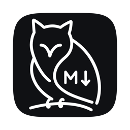
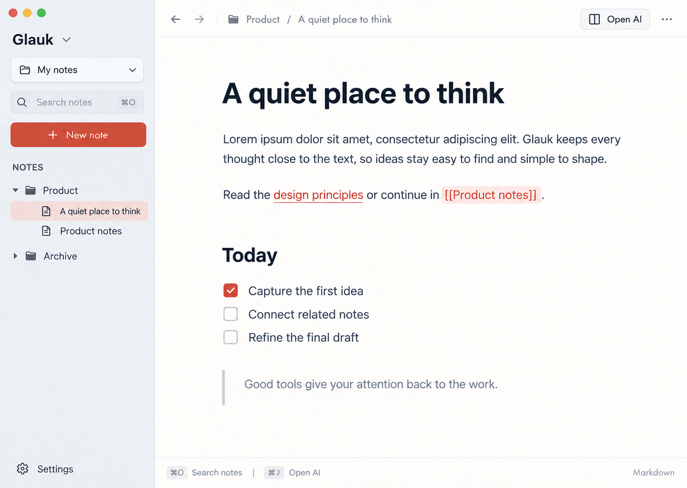

<p align="center">
  
</p>

<h1 align="center">Glauk</h1>

<p align="center">Obsidian 互換のリンクを、Obsidian なしで。<br>macOS 向けの Markdown エディタ。</p>



記法の文字を消さずに、見た目だけを整えます。
`[[リンク]]` はローカルフォルダを走査して解決するので、通信もプラグインも要りません。
Obsidian の vault をそのまま指定できます。

## できること

- Obsidian の記法をひととおり(見出し・チェックボックス・コールアウト・テーブル・数式・タグなど)
- コードのシンタックスハイライト
- `[[` 補完とリンク移動(⌘[ で戻る)。未作成リンクはその場で作れる
- ノートツリー(⌘\\)とクイックスイッチャー(⌘O)
- 沈黙する自動保存

## つくり

コアは Zig、UI は Swift + AppKit(TextKit 1)。
Zig は「どこからどこまでが何の記法か」だけを返し、Swift が属性を付けます。テキストは書き換えません。

## ビルド

```sh
cd core && zig build
open macos/Glauk/Glauk.xcodeproj
```

Zig 0.15.2 / Xcode が要ります。テストは `cd core && zig test src/root.zig`。

## 使いはじめ

右上の **vault を選ぶ…** でフォルダを指定すると、`[[` にそのノートが出ます。
指定しなくても、単一ファイルのエディタとして動きます。
